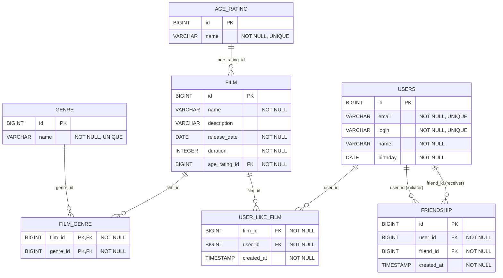

# java-filmorate

## Назначение схемы

Схема описывает доменную модель сервиса рекомендаций фильмов: пользователи регистрируются в системе, добавляют фильмы, отмечают понравившиеся фильмы и формируют связи дружбы. Фильмы классифицируются по жанрам и получают возрастное ограничение из централизованных справочников.

## Сущности и ограничения

| Таблица | Назначение | Основные ограничения |
|---|---|---|
| `users` | Профили пользователей сервиса | `email` и `login` обязательны и уникальны; `id` генерируется БД; дата рождения обязательна |
| `film` | Карточки фильмов | Обязательны название, дата релиза, длительность и возрастной рейтинг; каждый фильм ссылается на одну запись `age_rating` |
| `genre` | Справочник жанров | Идентификатор задаётся явно; название жанра обязательно и уникально |
| `age_rating` | Справочник возрастных ограничений | Идентификатор задаётся явно; код рейтинга обязателен и уникален |
| `film_genre` | Связь фильмов с жанрами | Составной первичный ключ `(film_id, genre_id)` исключает повторное назначение одинакового жанра фильму |
| `user_like_film` | Лайки пользователей | Уникальная пара `(film_id, user_id)` не позволяет пользователю поставить фильму более одного лайка |
| `friendship` | Заявки и подтверждённые связи дружбы | Запрещает заявку самому себе; пара `(user_id, friend_id)` уникальна |

## Справочник жанров (GENRE)

| ID | Наименование | Назначение |
|---:|---|---|
| 1 | Комедия | Фильмы, ориентированные на юмор и комедийные ситуации |
| 2 | Драма | Фильмы с фокусом на конфликте, отношениях и переживаниях персонажей |
| 3 | Мультфильм | Анимационные произведения |
| 4 | Триллер | Фильмы, строящиеся на напряжении, интриге и саспенсе |
| 5 | Документальный | Нехудожественные фильмы, основанные на реальных событиях, людях или фактах |
| 6 | Боевик | Фильмы с динамичным действием, погонями, боями или противостоянием |

## Справочник возрастных рейтингов (AGE_RAITING)

| ID | Код | Общий смысл |
|---:|---|---|
| 1 | `G` | Общая аудитория; содержание подходит для зрителей всех возрастов |
| 2 | `PG` | Рекомендуется родительское сопровождение или предварительная оценка содержания родителями |
| 3 | `PG-13` | Часть материалов может быть нежелательной для детей младше 13 лет |
| 4 | `R` | Ограниченный просмотр; для несовершеннолетних может потребоваться сопровождение взрослого |
| 5 | `NC-17` | Просмотр не допускается лицам младше 17 лет |

## Правила целостности

- В `film` нельзя сохранить ссылку на несуществующий возрастной рейтинг.
- В `film_genre` нельзя связать фильм с несуществующим жанром или добавить одну и ту же пару «фильм—жанр» повторно.
- При удалении фильма каскадно удаляются его жанровые связи и лайки.
- При удалении пользователя каскадно удаляются его лайки, отправленные заявки в друзья и заявки, где он указан получателем.
- Справочники `genre` и `age_rating` не имеют каскадного удаления: нельзя удалить значение справочника, на которое ссылается фильм или связь фильма с жанром.
- Дружба пользователей считается подтвержденной если для пары user_id и friend_id есть 2 записи. Неподтвержденная дружба 1 запись.